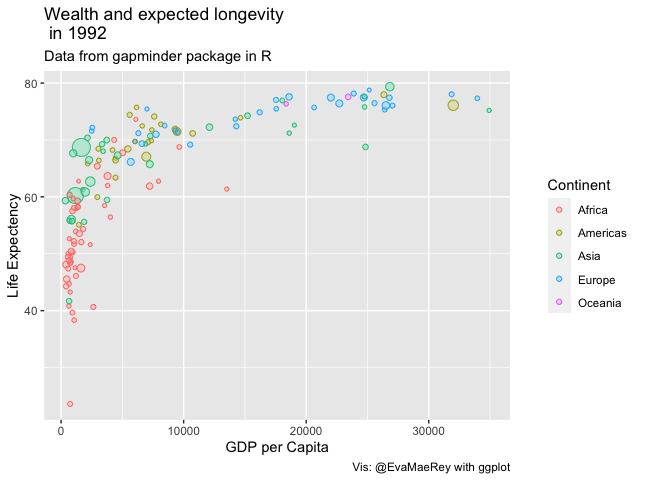
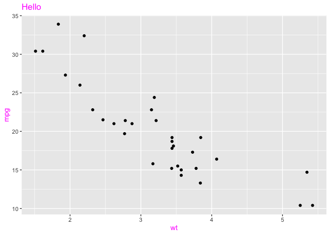

  - [Got to love base ggplot2’s fine-tune theming
    capabilities\!](#got-to-love-base-ggplot2s-fine-tune-theming-capabilities)
  - [yet… it feels kinda hard](#yet-it-feels-kinda-hard)
  - [Recognizing this, strategies
    exist](#recognizing-this-strategies-exist)
  - [Another proposal - function for each theme manipulation move (all
    the theme arguments). Write wrappers for all 97 arguments\!
    e.g. `theme_axis_text_y_left(color =
    "plum4")`](#another-proposal---function-for-each-theme-manipulation-move-all-the-theme-arguments-write-wrappers-for-all-97-arguments-eg-theme_axis_text_y_leftcolor--plum4)
      - [why?](#why)
          - [IDE guidance the whole way
            through\!](#ide-guidance-the-whole-way-through)
          - [more succinct user-facing
            code](#more-succinct-user-facing-code)
      - [why not?](#why-not)
          - [97 functions - Maintenance
            nightmare?](#97-functions---maintenance-nightmare)
          - [User’s might not gain an appreciation of how theming is
            organized in base ggplot2 and maintained in a disciplined,
            non-nightmarish
            way.](#users-might-not-gain-an-appreciation-of-how-theming-is-organized-in-base-ggplot2-and-maintained-in-a-disciplined-non-nightmarish-way)
      - [implementation demonstration, creating
        `theme_axis_text_y_left()`](#implementation-demonstration-creating-theme_axis_text_y_left)
      - [some ad-hoc tests…](#some-ad-hoc-tests)
      - [But write (and maintain) 97 functions without losing your
        mind?](#but-write-and-maintain-97-functions-without-losing-your-mind)
          - [categorize elements; save as csv in
            data\_raw](#categorize-elements-save-as-csv-in-data_raw)
          - [write function templates for each theme element
            type](#write-function-templates-for-each-theme-element-type)
          - [Write batches of functions, 30 for text elements, 29 for
            line, 11 for rect. unit and margin, not yet worked
            out.](#write-batches-of-functions-30-for-text-elements-29-for-line-11-for-rect-unit-and-margin-not-yet-worked-out)
          - [trying some of this out, I liked
            it\!](#trying-some-of-this-out-i-liked-it)
      - [more to explore…](#more-to-explore)
          - [margin & unit](#margin--unit)
      - [one-offs - these thematic adjustments don’t follow a
        pattern.](#one-offs---these-thematic-adjustments-dont-follow-a-pattern)
      - [How does it contrast to
        <https://github.com/tidyverse/ggplot2/issues/5301>?](#how-does-it-contrast-to-httpsgithubcomtidyverseggplot2issues5301)
      - [Bonus, no… maybe related to the issue.. just
        puzzled.](#bonus-no-maybe-related-to-the-issue-just-puzzled)

<!-- README.md is generated from README.Rmd. Please edit that file -->

# Got to love base ggplot2’s fine-tune theming capabilities\!

``` r
library(tidyverse)
#> ── Attaching core tidyverse packages ──────────────────────── tidyverse 2.0.0 ──
#> ✔ dplyr     1.1.0     ✔ readr     2.1.4
#> ✔ forcats   1.0.0     ✔ stringr   1.5.0
#> ✔ ggplot2   3.4.1     ✔ tibble    3.2.0
#> ✔ lubridate 1.9.2     ✔ tidyr     1.3.0
#> ✔ purrr     1.0.1     
#> ── Conflicts ────────────────────────────────────────── tidyverse_conflicts() ──
#> ✖ dplyr::filter() masks stats::filter()
#> ✖ dplyr::lag()    masks stats::lag()
#> ℹ Use the conflicted package (<http://conflicted.r-lib.org/>) to force all conflicts to become errors
gapminder::gapminder %>%  
  filter(year == 1992) %>%  
  ggplot() +  
  aes(x = gdpPercap, y = lifeExp) +  
  geom_point(alpha = .8, shape = 21,  
             fill = "white") +  
  aes(col = continent, fill = continent) +  
  geom_point(alpha = .3, shape = 21) +  
  aes(size = pop) +  
  scale_size(guide = F) +  
  labs(title = "Wealth and expected longevity\n in 1992") +  
  labs(subtitle = "Data from gapminder package in R") +  
  labs(x = "GDP per Capita") +  
  labs(y = "Life Expectency") +  # a tag is also an option
  labs(col = "Continent", fill = "Continent") +  
  labs(caption = "Vis: @EvaMaeRey with ggplot") ->  
g; g
#> Warning: The `guide` argument in `scale_*()` cannot be `FALSE`. This was deprecated in
#> ggplot2 3.3.4.
#> ℹ Please use "none" instead.
#> This warning is displayed once every 8 hours.
#> Call `lifecycle::last_lifecycle_warnings()` to see where this warning was
#> generated.
```

<!-- -->

``` r

g +  
  theme(plot.title.position = "plot") +  
  theme(plot.tag =  
          element_text(color = "plum4", size = 25)) +  
  theme(plot.title =  
          element_text(color = "plum4",  
                       size = 20,  
                       lineheight = 2.5)) +  
  theme(plot.subtitle = element_text(color = "plum4")) +  
  theme(axis.title.y =  
          element_text(color = "plum4",  
                       size = rel(3))) +  
  theme(axis.text.y.left = element_text(color = "plum4")) +  
  theme(legend.title =  
          element_text(color = "plum4", size = 22)) +  
  theme(legend.text = element_text(color = "plum4")) +  
  theme(axis.title.x = element_text(color = "plum4")) +  
  theme(axis.text.x = element_text(color = "plum4")) +  
  theme(plot.caption =  
          element_text(color = "plum4", size = 20)) +  
  theme(text = element_text(family = "Times")) +  
  theme(text = element_text(face = "bold.italic")) +  
  theme(text = element_text(  
    margin = margin(t = 3, r = 3, b = 3, l = 3,  
                    unit = "pt"))) +  
  theme(text = element_text(angle = 2)) +  
  theme(plot.title = element_text(hjust = .5)) +  
  theme(axis.title.x = element_text(hjust = 1))
```

<!-- -->

# yet… it feels kinda hard

# Recognizing this, strategies exist

People have tried to make theming easier in ggplot2

  - ggthemes: creating good bundled themes (also within ggplot2
    theme\_minimal, theme\_bw etc)
  - ggeasy: creating functions that match natural language
  - <https://evamaerey.github.io/ggplot2_grammar_guide/themes.html>:
    creating comprehensive resource for consultation

<!-- badges: start -->

<!-- badges: end -->

# Another proposal - function for each theme manipulation move (all the theme arguments). Write wrappers for all 97 arguments\! e.g. `theme_axis_text_y_left(color = "plum4")`

``` r
# instead of:
theme(axis.text.y.left = element_text(color = "plum4"))
# rearrange to: 
theme_axis_text_y_left(color = "plum4")
```

## why?

### IDE guidance the whole way through\!

Unfortunately, theme() IDE guidance is very unhelpful. For example the
RStudio IDE will tell you all the theme elements, but what do you do
from there? Once you selected your theme element, e.g. you’ve got
‘theme(strip.text.y.left = )’ the IDE is done helping out. If you know
to type `element_text(` then you’ll get some more help, but many ggplot2
don’t do this.

By providing wrappers like theme\_strip\_text\_y\_left(), we can provide
all of the arguments that are potentially changeable for the element of
interest. The plot creator will be remind of the arguments ‘family’,
‘face’, ‘colour’, "angle’, ‘hjust’ etc, arguments that can be changed.

### more succinct user-facing code

Furthermore, the user syntax is shorter, eliminating repetition of text.

## why not?

### 97 functions - Maintenance nightmare?

### User’s might not gain an appreciation of how theming is organized in base ggplot2 and maintained in a disciplined, non-nightmarish way.

## implementation demonstration, creating `theme_axis_text_y_left()`

``` r
theme_axis_text_y_left <- function(family = NULL,
                              face = NULL,
                              colour = NULL,
                              size = NULL,
                              hjust = NULL,
                              vjust = NULL,
                              angle = NULL,
                              lineheight = NULL,
                              color = NULL,
                              margin = NULL,
                              debug = NULL,
                              inherit.blank = FALSE,
                              element_blank = FALSE){
  
         theme_element <- theme(axis.text.y.left = 
                  element_text(family = family,
                  face = face,
                  colour = colour,
                  size = size,
                  hjust = hjust,
                  vjust = vjust,
                  angle = angle,
                  lineheight = lineheight,
                  color = color,
                  margin = margin,
                  debug = debug,
                  inherit.blank = inherit.blank))
            
            if(element_blank){
              theme(axis.text.y = element_blank())
            }

return(theme_element)
  
}
```

## some ad-hoc tests…

``` r
theme(axis.text.y.left = element_text(color = "red"))
#> List of 1
#>  $ axis.text.y.left:List of 11
#>   ..$ family       : NULL
#>   ..$ face         : NULL
#>   ..$ colour       : chr "red"
#>   ..$ size         : NULL
#>   ..$ hjust        : NULL
#>   ..$ vjust        : NULL
#>   ..$ angle        : NULL
#>   ..$ lineheight   : NULL
#>   ..$ margin       : NULL
#>   ..$ debug        : NULL
#>   ..$ inherit.blank: logi FALSE
#>   ..- attr(*, "class")= chr [1:2] "element_text" "element"
#>  - attr(*, "class")= chr [1:2] "theme" "gg"
#>  - attr(*, "complete")= logi FALSE
#>  - attr(*, "validate")= logi TRUE
theme_axis_text_y_left(color = "red")
#> List of 1
#>  $ axis.text.y.left:List of 11
#>   ..$ family       : NULL
#>   ..$ face         : NULL
#>   ..$ colour       : chr "red"
#>   ..$ size         : NULL
#>   ..$ hjust        : NULL
#>   ..$ vjust        : NULL
#>   ..$ angle        : NULL
#>   ..$ lineheight   : NULL
#>   ..$ margin       : NULL
#>   ..$ debug        : NULL
#>   ..$ inherit.blank: logi FALSE
#>   ..- attr(*, "class")= chr [1:2] "element_text" "element"
#>  - attr(*, "class")= chr [1:2] "theme" "gg"
#>  - attr(*, "complete")= logi FALSE
#>  - attr(*, "validate")= logi TRUE
```

``` r
g + theme_axis_text_y_left(color = "red")
```

<!-- -->

``` r
g + theme(axis.text.y.left = element_text(color = "red"))
```

<!-- -->

## But write (and maintain) 97 functions without losing your mind?

### categorize elements; save as csv in data\_raw

``` r
elements_type <- tribble(
~element, ~element_type,
"line", "line",
"rect", "rect",
"text", "text",
"title", "text",
"aspect.ratio", "aspect ratio of the panel",
"axis.title", "text", 
"axis.title.x", "text",
"axis.title.x.top", "text",
"axis.title.x.bottom", "text",
"axis.title.y", "text",
"axis.title.y.left", "text",
"axis.title.y.right", "text",
"axis.text", "text",
"axis.text.x", "text",
"axis.text.x.top", "text",
"axis.text.x.bottom", "text",
"axis.text.y", "text",
"axis.text.y.left", "text",
"axis.text.y.right", "text",
"axis.ticks", "line",
"axis.ticks.x", "line",
"axis.ticks.x.top", "line",
"axis.ticks.x.bottom", "line",
"axis.ticks.y", "line",
"axis.ticks.y.left", "line",
"axis.ticks.y.right", "line",
"axis.ticks.length", "line",
"axis.ticks.length.x", "line",
"axis.ticks.length.x.top", "line",
"axis.ticks.length.x.bottom", "line",
"axis.ticks.length.y", "line",
"axis.ticks.length.y.left", "line",
"axis.ticks.length.y.right", "line",
"axis.line", "line",
"axis.line.x", "line",
"axis.line.x.top", "line",
"axis.line.x.bottom", "line",
"axis.line.y", "line",
"axis.line.y.left", "line",
"axis.line.y.right", "line",
"legend.background", "rect",
"legend.margin", "margin",
"legend.spacing", "unit",
"legend.spacing.x", "unit",
"legend.spacing.y", "unit",
"legend.key", "rect",
"legend.key.size", "unit",
"legend.key.height", "unit",
"legend.key.width", "unit",
"legend.text", "text",
"legend.text.align", 'the position of legends ("none", "left", "right", "bottom", "top", or two-element numeric vector)',
"legend.title", "text",
"legend.title.align", "text",
"legend.position", 'the position of legends ("none", "left", "right", "bottom", "top", or two-element numeric vector)',
"legend.direction", 'layout of items in legends ("horizontal" or "vertical")',
"legend.justification", 'anchor point for positioning legend inside plot ("center" or two-element numeric vector) or the justification according to the plot area when positioned outside the plot',
"legend.box", "rect",
"legend.box.just", 'justification of each legend within the overall bounding box, when there are multiple legends ("top", "bottom", "left", or "right")',
"legend.box.margin", "margin",
"legend.box.background", "rect",
"legend.box.spacing", "unit",
"panel.background", "rect",
"panel.border", "rect",
"panel.spacing", "unit",
"panel.spacing.x", "unit",
"panel.spacing.y", "unit",
"panel.grid", "line",
"panel.grid.major", "line",
"panel.grid.minor", "line",
"panel.grid.major.x", "line",
"panel.grid.major.y", "line",
"panel.grid.minor.x", "line",
"panel.grid.minor.y", "line",
"panel.ontop", 'option to place the panel (background, gridlines) over the data layers (logical). Usually used with a transparent or blank panel.background',
"plot.background", "rect",
"plot.title", "text",
"plot.title.position", 'Alignment of the plot title/subtitle and caption. The setting for plot.title.position applies to both the title and the subtitle. A value of "panel" (the default) means that titles and/or caption are aligned to the plot panels. A value of "plot" means that titles and/or caption are aligned to the entire plot (minus any space for margins and plot tag).',
"plot.subtitle", "text",
"plot.caption", "text",
"plot.caption.position", 'Alignment of the plot title/subtitle and caption. The setting for plot.title.position applies to both the title and the subtitle. A value of "panel" (the default) means that titles and/or caption are aligned to the plot panels. A value of "plot" means that titles and/or caption are aligned to the entire plot (minus any space for margins and plot tag).',
"plot.tag", "text",
"plot.tag.position", 'The position of the tag as a string ("topleft", "top", "topright", "left", "right", "bottomleft", "bottom", "bottomright) or a coordinate. If a string, extra space will be added to accommodate the tag.',
"plot.margin", 'margin',
"strip.background", "rect",
"strip.background.x", "rect",
"strip.background.y", "rect",
"strip.clip", 'should strip background edges and strip labels be clipped to the extend of the strip background? Options are "on" to clip, "off" to disable clipping or "inherit" (default) to take the clipping setting from the parent viewport.',
"strip.placement", 'placement of strip with respect to axes, either "inside" or "outside". Only important when axes and strips are on the same side of the plot.',
"strip.text", "text",
"strip.text.x", "text",
"strip.text.x.bottom", "text",
"strip.text.x.top", "text",
"strip.text.y", "text",
"strip.text.y.left", "text",
"strip.text.y.right", "text",
"strip.switch.pad.grid", "unit",
"strip.switch.pad.wrap", "unit")

dim(elements_type)
#> [1] 97  2

elements_type %>% 
  count(element_type) %>% 
  filter(n >= 3)
#> # A tibble: 5 × 2
#>   element_type     n
#>   <chr>        <int>
#> 1 line            29
#> 2 margin           3
#> 3 rect            11
#> 4 text            30
#> 5 unit            12
```

### write function templates for each theme element type

Possible pre-step: write table for which arguments are used for each
element type.

``` r

adjustables <- tibble::tribble(~ argument, ~ind_text, ~ind_line, ~ind_rect, ~default, 
"family", T, F, F, NULL,
"face", T, F, F,NULL,
"fill", F, F, T,NULL,
"colour", T, T, T,NULL,
"linewidth", F, T, F, NULL,
"linetype", F, T, F, NULL,
"lineend" , F, T, F, NULL,
"arrow" , F, T, F,  NULL,
"size", T, T, T, NULL, # oh-oh
"hjust", T, F, F, NULL,
"vjust ", T, F, F, NULL,
"angle ", T, F, F, NULL,
"lineheight" , T, F, F, NULL,
"color", T, F, F, NULL,
"margin", T, F, F, NULL,
"debug", T, T, T, NULL,
"inherit.blank", T, T, T, FALSE,
"element_blank",  T, T, T, FALSE)
```

#### text elements template

``` r
text_theme_function_template <- 'theme_axis_text_y_left <- function(family = NULL,
                              face = NULL,
                              colour = NULL,
                              size = NULL,
                              hjust = NULL,
                              vjust = NULL,
                              angle = NULL,
                              lineheight = NULL,
                              color = NULL,
                              margin = NULL,
                              debug = NULL,
                              inherit.blank = FALSE,
                              element_blank = FALSE){
  
         theme_element <- theme(axis.text.y.left = 
                  element_text(family = family,
                  face = face,
                  colour = colour,
                  size = size,
                  hjust = hjust,
                  vjust = vjust,
                  angle = angle,
                  lineheight = lineheight,
                  color = color,
                  margin = margin,
                  debug = debug,
                  inherit.blank = inherit.blank)
                  )
            
            if(element_blank){
              theme_element <- theme(axis.text.y.left = 
              element_blank())
            }

return(theme_element)
  
}'
```

#### rect elements template

``` r
rect_theme_function_template <- 'theme_panel_background <- function(
                                fill = NULL,
                                  colour = NULL,
                                  linewidth = NULL,
                                  linetype = NULL,
                                  color = NULL,
                                  inherit.blank = FALSE,
                                  size = NULL,
                                #size = deprecated(), # Error in deprecated() : could not find function "deprecated"
                                element_blank = FALSE){
  
         theme_element <- theme(panel.background = 
                  element_rect(
                                  fill = fill,
                                  colour = colour,
                                  linewidth = linewidth,
                                  linetype = linetype,
                                  color = color,
                                  inherit.blank = inherit.blank,
                                  size = size
                                )
         )

            
            if(element_blank){
              theme_element <- theme(panel.background = 
              element_blank())
            }

return(theme_element)
  
}'
```

#### line elements template

``` r
line_theme_function_template <- 'theme_axis_line_y_left <- function(
                              colour = NULL,
                              linewidth = NULL,
                                linetype = NULL,
                                lineend = NULL,
                                color = NULL,
                                arrow = NULL,
                                inherit.blank = FALSE,
                                size = NULL,
                                #size = deprecated(), # Error in deprecated() : could not find function "deprecated"
                                element_blank = FALSE){
  
         theme_element <- theme(axis.line.y.left = 
                  element_line(
                                colour = colour,
                                linewidth = linewidth,
                                linetype = linetype,
                                lineend = lineend,
                                color = color,
                                arrow = arrow,
                                inherit.blank = inherit.blank,
                                size = size
                              )
         )

            
            if(element_blank){
              theme_element <- theme(axis.line.y.left = 
              element_blank())
            }

return(theme_element)
  
}'
```

### Write batches of functions, 30 for text elements, 29 for line, 11 for rect. unit and margin, not yet worked out.

#### Write text element function wrappers, using template

``` r
elements_type %>% 
  filter(element_type == "text") %>% 
  mutate(element_w_underscores = 
           element %>% str_replace_all("\\.", "_")) %>% 
  mutate(function_col = str_replace_all(text_theme_function_template, "axis_text_y_left", 
                                        element_w_underscores)) %>% 
  mutate(function_col = str_replace_all(function_col, "axis\\.text\\.y\\.left", 
                                        element)) ->
text_elements_type_functions
  
dim(text_elements_type_functions)
#> [1] 30  4

# inspect one of the prepared functions.
text_elements_type_functions[5,4][[1]] %>% cat
#> theme_axis_title_x_top <- function(family = NULL,
#>                               face = NULL,
#>                               colour = NULL,
#>                               size = NULL,
#>                               hjust = NULL,
#>                               vjust = NULL,
#>                               angle = NULL,
#>                               lineheight = NULL,
#>                               color = NULL,
#>                               margin = NULL,
#>                               debug = NULL,
#>                               inherit.blank = FALSE,
#>                               element_blank = FALSE){
#>   
#>          theme_element <- theme(axis.title.x.top = 
#>                   element_text(family = family,
#>                   face = face,
#>                   colour = colour,
#>                   size = size,
#>                   hjust = hjust,
#>                   vjust = vjust,
#>                   angle = angle,
#>                   lineheight = lineheight,
#>                   color = color,
#>                   margin = margin,
#>                   debug = debug,
#>                   inherit.blank = inherit.blank)
#>                   )
#>             
#>             if(element_blank){
#>               theme_element <- theme(axis.title.x.top = 
#>               element_blank())
#>             }
#> 
#> return(theme_element)
#>   
#> }

text_elements_type_functions$function_col %>% 
  paste(collapse = "
        
        
") %>% 
  writeLines(con = "R/text_elements_functions.R")
```

#### Write line element function wrappers, using template

``` r
elements_type %>% 
  filter(element_type == "line") %>% 
  mutate(element_w_underscores = 
           element %>% str_replace_all("\\.", "_")) %>% 
  mutate(function_col = str_replace_all(line_theme_function_template, "axis_line_y_left", 
                                        element_w_underscores)) %>% 
  mutate(function_col = str_replace_all(function_col, "axis\\.line\\.y\\.left", 
                                        element)) ->
line_elements_type_functions
  
dim(line_elements_type_functions)
#> [1] 29  4

# inspect one of the prepared functions.
line_elements_type_functions[5,4][[1]] %>% cat
#> theme_axis_ticks_x_bottom <- function(
#>                               colour = NULL,
#>                               linewidth = NULL,
#>                                 linetype = NULL,
#>                                 lineend = NULL,
#>                                 color = NULL,
#>                                 arrow = NULL,
#>                                 inherit.blank = FALSE,
#>                                 size = NULL,
#>                                 #size = deprecated(), # Error in deprecated() : could not find function "deprecated"
#>                                 element_blank = FALSE){
#>   
#>          theme_element <- theme(axis.ticks.x.bottom = 
#>                   element_line(
#>                                 colour = colour,
#>                                 linewidth = linewidth,
#>                                 linetype = linetype,
#>                                 lineend = lineend,
#>                                 color = color,
#>                                 arrow = arrow,
#>                                 inherit.blank = inherit.blank,
#>                                 size = size
#>                               )
#>          )
#> 
#>             
#>             if(element_blank){
#>               theme_element <- theme(axis.ticks.x.bottom = 
#>               element_blank())
#>             }
#> 
#> return(theme_element)
#>   
#> }

line_elements_type_functions$function_col %>% 
  paste(collapse = "
        
        
") %>% 
  writeLines(con = "R/line_elements_functions.R")
```

#### Write rect element function wrappers, using template

``` r

elements_type %>% 
  filter(element_type == "rect") %>% 
  mutate(element_w_underscores = 
           element %>% str_replace_all("\\.", "_")) %>% 
  mutate(function_col = str_replace_all(rect_theme_function_template, "panel_background", 
                                        element_w_underscores)) %>% 
  mutate(function_col = str_replace_all(function_col, "panel\\.background", 
                                        element)) ->
rect_elements_type_functions
  
dim(rect_elements_type_functions)
#> [1] 11  4

# inspect one of the prepared functions.
rect_elements_type_functions[5,4][[1]] %>% cat
#> theme_legend_box_background <- function(
#>                                 fill = NULL,
#>                                   colour = NULL,
#>                                   linewidth = NULL,
#>                                   linetype = NULL,
#>                                   color = NULL,
#>                                   inherit.blank = FALSE,
#>                                   size = NULL,
#>                                 #size = deprecated(), # Error in deprecated() : could not find function "deprecated"
#>                                 element_blank = FALSE){
#>   
#>          theme_element <- theme(legend.box.background = 
#>                   element_rect(
#>                                   fill = fill,
#>                                   colour = colour,
#>                                   linewidth = linewidth,
#>                                   linetype = linetype,
#>                                   color = color,
#>                                   inherit.blank = inherit.blank,
#>                                   size = size
#>                                 )
#>          )
#> 
#>             
#>             if(element_blank){
#>               theme_element <- theme(legend.box.background = 
#>               element_blank())
#>             }
#> 
#> return(theme_element)
#>   
#> }

rect_elements_type_functions$function_col %>% 
  paste(collapse = "
        
        
") %>% 
  writeLines(con = "R/rect_elements_functions.R")
```

### trying some of this out, I liked it\!

``` r
source("R/text_elements_functions.R") # 30 proposed functions to adjust text.
source("R/line_elements_functions.R") # 29 proposed functions to adjust line elements
source("R/rect_elements_functions.R") # 7 proposed functions to adjust rect elements

g +  
  theme_axis_text_y_left(angle = 30, color = "red") +
  # theme_axis_text_x(angle = 50, hjust = 1) + 
  theme(axis.text.x = element_text(angle = 50, hjust = 1)) +
  # theme_text(color = "blue") + 
  theme(text = element_text(color = "blue")) + 
  theme_title(face = "bold.italic", lineheight = 1.5) + 
  theme_axis_line_x(colour = "darkred", 
                    linetype = "dashed", 
                    size = 2  # ggplot2_3.4.1  :-)
                    ) + 
  theme_panel_grid(color = "green") + 
  theme_panel_grid_minor(color = "orange") + 
  theme_panel_border(color = "magenta", size = 2, fill = alpha("pink", .2)) + 
  theme_legend_background(fill = "goldenrod1") + 
  theme_panel_background(fill = "yellow")
#> Warning: The `size` argument of `element_line()` is deprecated as of ggplot2 3.4.0.
#> ℹ Please use the `linewidth` argument instead.
#> This warning is displayed once every 8 hours.
#> Call `lifecycle::last_lifecycle_warnings()` to see where this warning was
#> generated.
#> Warning: The `size` argument of `element_rect()` is deprecated as of ggplot2 3.4.0.
#> ℹ Please use the `linewidth` argument instead.
#> This warning is displayed once every 8 hours.
#> Call `lifecycle::last_lifecycle_warnings()` to see where this warning was
#> generated.
```

<!-- -->

``` r

dim(elements_type)
#> [1] 97  2
```

## more to explore…

### margin & unit

``` r
elements_type %>% 
  count(element_type) %>% 
  filter(n >= 3)
#> # A tibble: 5 × 2
#>   element_type     n
#>   <chr>        <int>
#> 1 line            29
#> 2 margin           3
#> 3 rect            11
#> 4 text            30
#> 5 unit            12

elements_type %>% 
  filter(element_type == "unit") 
#> # A tibble: 12 × 2
#>    element               element_type
#>    <chr>                 <chr>       
#>  1 legend.spacing        unit        
#>  2 legend.spacing.x      unit        
#>  3 legend.spacing.y      unit        
#>  4 legend.key.size       unit        
#>  5 legend.key.height     unit        
#>  6 legend.key.width      unit        
#>  7 legend.box.spacing    unit        
#>  8 panel.spacing         unit        
#>  9 panel.spacing.x       unit        
#> 10 panel.spacing.y       unit        
#> 11 strip.switch.pad.grid unit        
#> 12 strip.switch.pad.wrap unit

elements_type %>% 
  filter(element_type == "margin") 
#> # A tibble: 3 × 2
#>   element           element_type
#>   <chr>             <chr>       
#> 1 legend.margin     margin      
#> 2 legend.box.margin margin      
#> 3 plot.margin       margin


g +
  theme(legend.margin = margin(t = 1, r = 1, b = 1, l = .6, unit='cm'))
```

<!-- -->

``` r

g  + 
  theme(legend.box.spacing = unit(x = 2, units = "cm"))
```

<!-- -->

## one-offs - these thematic adjustments don’t follow a pattern.

``` r
elements_type %>% 
  group_by(element_type) %>% 
  filter(n() < 3) 
#> # A tibble: 12 × 2
#> # Groups:   element_type [10]
#>    element               element_type                                           
#>    <chr>                 <chr>                                                  
#>  1 aspect.ratio          "aspect ratio of the panel"                            
#>  2 legend.text.align     "the position of legends (\"none\", \"left\", \"right\…
#>  3 legend.position       "the position of legends (\"none\", \"left\", \"right\…
#>  4 legend.direction      "layout of items in legends (\"horizontal\" or \"verti…
#>  5 legend.justification  "anchor point for positioning legend inside plot (\"ce…
#>  6 legend.box.just       "justification of each legend within the overall bound…
#>  7 panel.ontop           "option to place the panel (background, gridlines) ove…
#>  8 plot.title.position   "Alignment of the plot title/subtitle and caption. The…
#>  9 plot.caption.position "Alignment of the plot title/subtitle and caption. The…
#> 10 plot.tag.position     "The position of the tag as a string (\"topleft\", \"t…
#> 11 strip.clip            "should strip background edges and strip labels be cli…
#> 12 strip.placement       "placement of strip with respect to axes, either \"ins…
```

## How does it contrast to <https://github.com/tidyverse/ggplot2/issues/5301>?

## Bonus, no… maybe related to the issue.. just puzzled.

I’m expecting all text and line elements to become ‘magenta’

``` r
theme_color <- function(color = "black"){

  theme_get() %+replace%
  ggplot2::theme(text = element_text(color = color)) %+replace%
  ggplot2::theme(line = element_line(color = color)) %+replace%
  ggplot2::theme(rect = element_rect(color = color))
  
  }
  
ggplot(mtcars) + 
  aes(x = wt, y = mpg) +
  geom_point()  + 
  labs(title = "Hello") + 
  ggplot2::theme(text = element_text(color = "magenta")) +
  ggplot2::theme(line = element_line(color = "magenta")) + 
  ggplot2::theme(rect = element_rect(color = "magenta")) 
```

<!-- -->

``` r

last_plot() +  # seems like last plot should have changed line color hmmm.... 
  ggplot2::theme(panel.grid = element_line(color = "magenta"))
```

<!-- -->

``` r


ggplot(mtcars) + 
  aes(x = wt, y = mpg) +
  geom_point()  + 
  labs(title = "Hello") + 
  theme_color(color = "red")
```

<!-- -->
